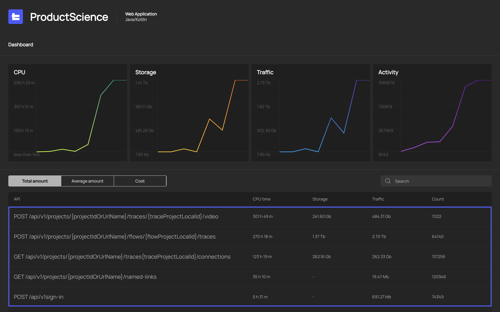
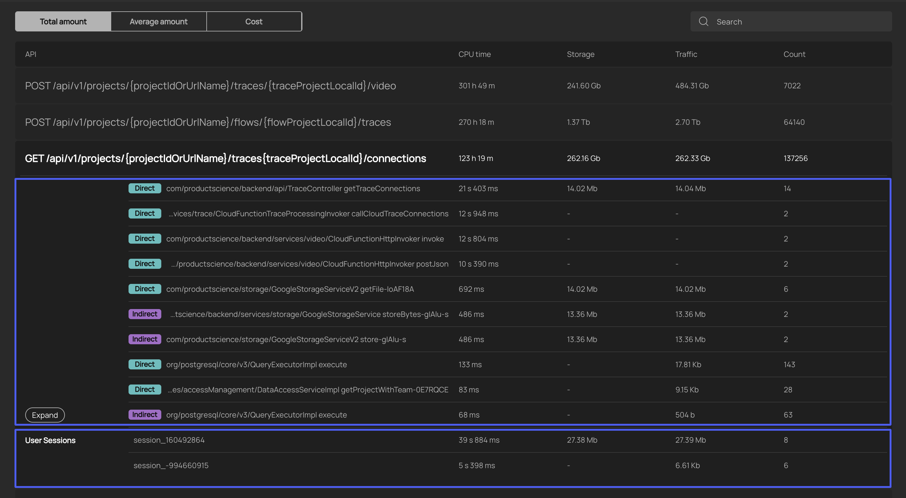
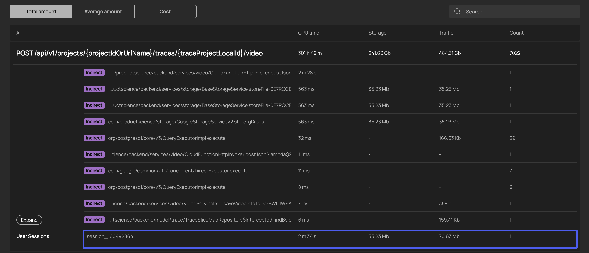
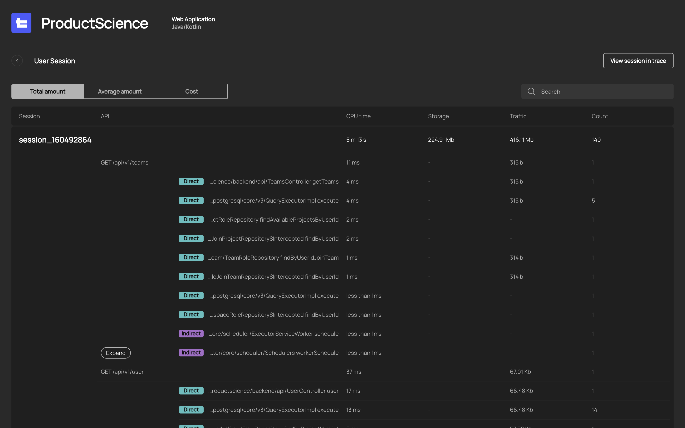
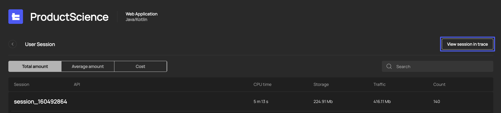
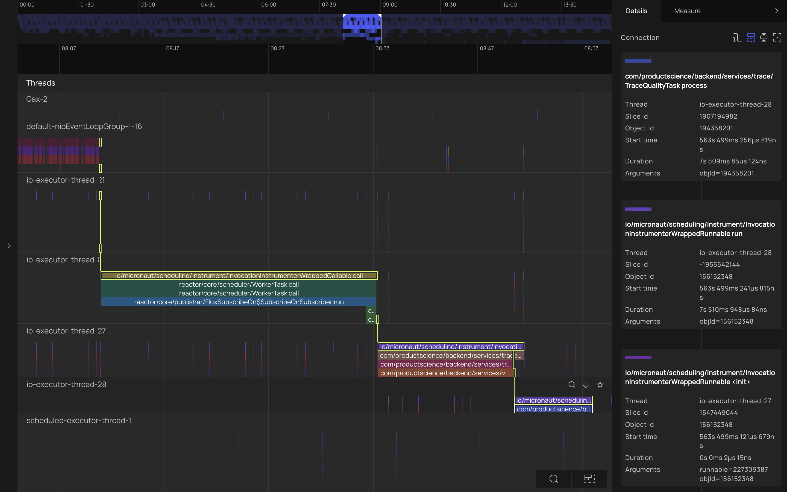

# Usage

## Detect expensive API

The Dashboard Screen provides a consolidated view of CPU 
and Storage usage, along with traffic and activity. 
Below the main dashboards, you'll find a detailed breakdown of 
these metrics for each API. 

For each API call, you can see a breakdown by Direct and Indirect calls. 
Direct calls are the code synchronously execute durgin API request, while Indirect calls 
represent all side effects as asyncrously executed methods. 
Additionally, you can view specific 
user sessions related to each API call, helping you understand the context 
of the resource usage.

By leveraging this high-level overview of your cloud resource consumption, 
you can quickly identify the most resource-intensive APIs and take action 
to optimize them.

## Analyze as part of a user session

For each API, you can select specific user sessions where the API was called. 
This provides valuable insights into the sequence and context of API calls.

When you open a particular user session, you’ll see details of all API calls 
within that session.

The User Session screen offers a detailed overview of each session. For a 
deeper dive and more granular insights, check out the trace view in the 
next section.

## Analyze trace 

The Trace View provides a detailed recording of each user session, capturing 
all direct and indirect API calls, and highlighting any dependencies between them. 
To open a trace, click on the "View session in trace" button of the 
User Session screen. 
This comprehensive view helps you understand the full context of API 
interactions and resource usage.

By examining the trace file, you can identify specific points where performance 
can be optimized. You'll see how different calls interact, any dependencies 
causing delays, and where resource consumption spikes. This can help uncover 
hidden costs and unexpected behaviors that is not apparent from the 
high-level overview.

With this deep dive into the trace data, you can make informed decisions to 
fine-tune your APIs and improve overall performance, ultimately reducing 
your cloud costs.
