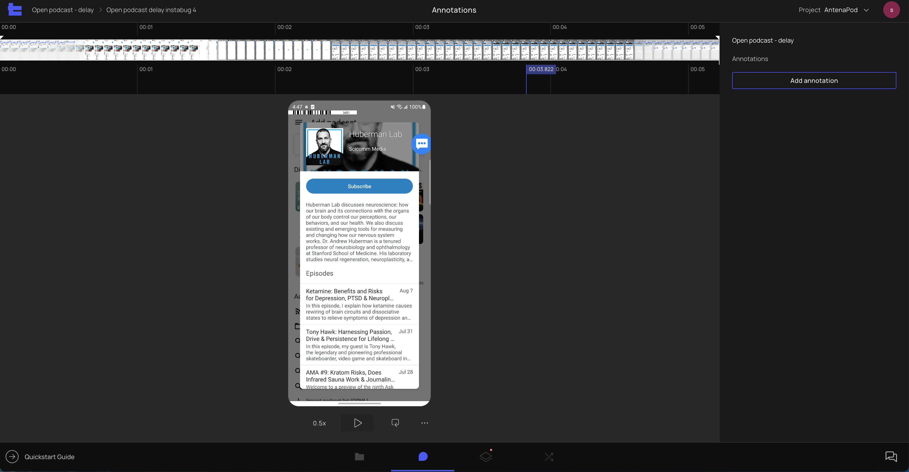

# R1.4 - Annotations

At Product Science, we believe that optimizing your app's performance should start with the most important screens for your business—ones 
that drive engagement and app retention. In this release, we are reinforcing our approach by helping our customers define the most critical 
user flows even before the team begins to look at the code.

- In the new Annotations screen, even non-technical customers will be able to easily mark the beginning and end of the user flow that requires performance optimization. This is achieved by placing human-readable annotations on top of the video.
- The new Processes x Annotations screen provides tools to connect the human-readable annotations to the code level of your app, making it easy to understand exactly where on the code level the user flow starts and ends.
- The updated Trace Viewer screen will highlight the beginning and end of the user flow so engineers can focus on this specific part of the 
trace and disregard the rest.

## New Screen - Annotations

The new annotation screen enables you to mark the beginning of a user flow (i.e. the user’s action) and the end of a user flow (i.e. the 
reaction from the app) based on your screen recording.

## New Screen - Processes x Annotations

The PxA Screen enables users to connect annotations made in the previous Annotations screen to slices. This step will allow us to mark the 
beginning and end of the user flow on the code level. Joining videos and slices together provides solid visual cues that can’t be gained 
from the code alone.
