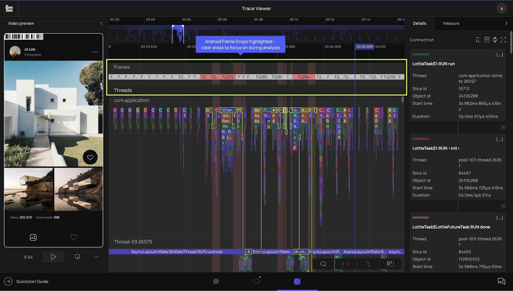

# Frame Drop Visualization for Android

In our continuous effort to enhance the performance analysis capabilities of PS Tool, we’ve focused on refining our feature, highlighting 
long frames. This feature helps identify frames that remain on screen longer than expected based on the current device’s frame rate, 
pinpointing areas where the main thread is overwhelmed, particularly during scroll performance analysis. Building on this, we’ve updated our 
highlighting strategy for frames on Android.

PS Tool now highlights fewer frames, taking into account clusterization to better focus on scroll performance analysis. 
This means we only highlight frames that take 2x longer than expected and clusters of several longer frames, even if they don’t reach 
the 2x threshold. This approach confirms the same frame patterns previously reported via PS Tool by performance analysts while significantly 
reducing noise. 

How it looks now: fewer frames highlighted, clear focus on UI Thread Hangs.

