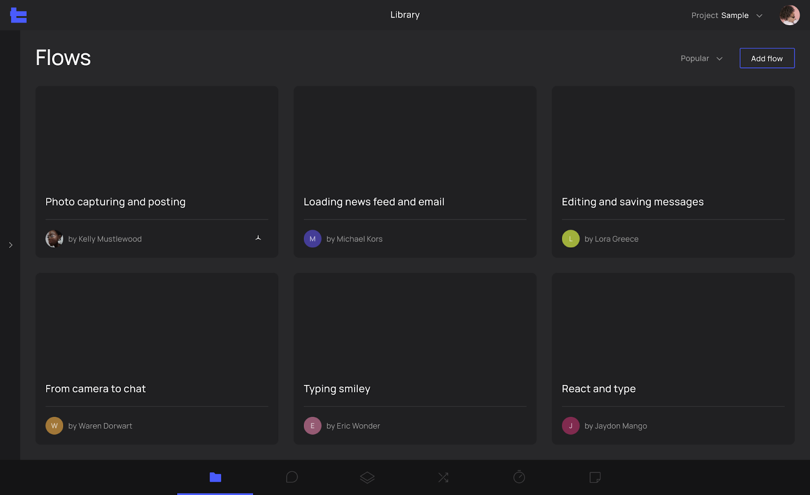

# R1.1 - New UX & UI

## Flow Library

- Create, view and delete flows
- Sort flow by favorites, popularity, last edited, and by name

## Flow View
- View the list of traces associated with a specific flow 
- Edit flow name and description
- Subscribe to flow updates
- Add new traces
- Select from unassigned traces
- Manually upload traces
- Quickly filter by "My traces only”
- Filter any field of the table and remove traces from the flow or attach them to a different flow

## Unassigned traces view
- Assign traces to one or multiple flows
- Quick filter by "My traces only”
- Filter any field of the table

## Trace Viewer

- Main Timeline (Flame Chart)
  -   Display slices on timeline, sorted by time
  -   Display slices full name on hover
  -   Ability to zoom with WASD or trackpad
  -   Arrow measurement. Enable you to understand the duration of one function to another
  -   Ability to add/remove any thread to favorites
- Global Timeline (Aggregation View)
  -   Display preview of the whole timeline in a condensed view
  -   Ability to set start and end of the focus zone of the video timeline, synced with the flame graph timeline
- Search 
- Connections
  -   Build new connections
  -   Build connection with real-time feedback
  -   Visually highlighting slices available for connections
- Flags
  -   Ability to add/remove flag
  -   Ability to drag and change flag position
  -   Ability to label, change color, and add notes to flags
- Details View
  -   Display slice info
  -   Display execution path info
- Execution paths feature
  -   Ability to show the full execution path available for the selected slice
  -   Filter out inactive threads and sort remaining threads by start time
  -   Show only the necessary depth of thread
