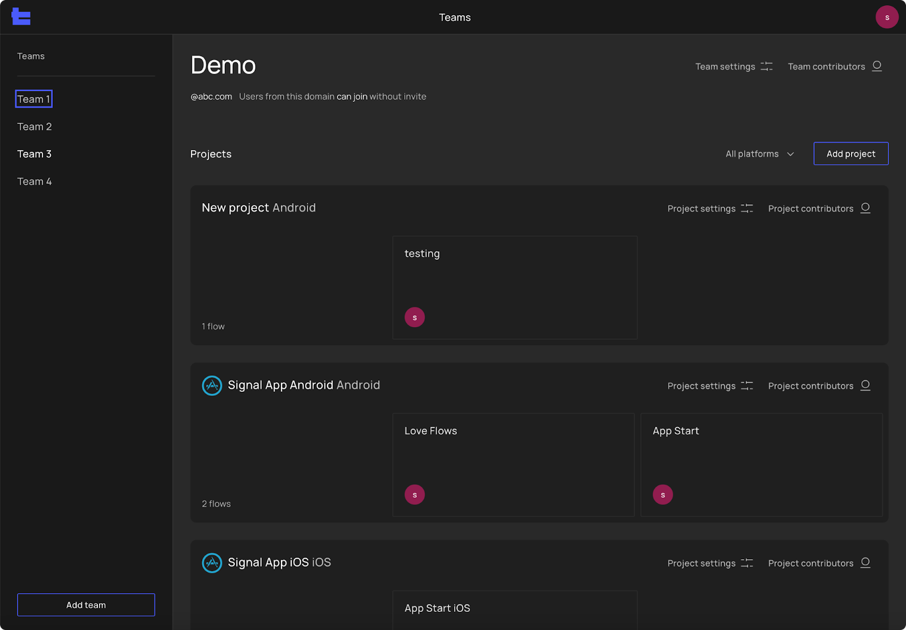
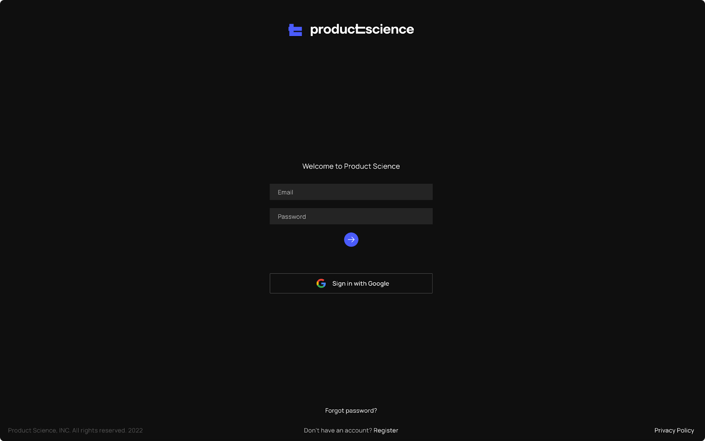

# R1.2 - Admin

## Admin Screen

A system for monitoring, maintaining, and controlling user access to your teams and projects. This is where you can:
- Update project icons and details
- Remove project
- Update team member's role
- Send/Resend invitation link 
- Add/Remove a team member
- Enable/ disable the domain allow list so that team members of your organization can join

## Login Screen

- SSO with Google
- Reset password
- Register account

## Flow Library 
- Ability to add, save and edit Flow titles and descriptions.

## Trace Viewer
[New]
- Tools to prioritize and deprioritize threads so that you can better see an execution path
- Pin thread
- Deprioritize thread
- Toggle to show all paths or the main execution path
- "Show all paths" lets you see additional information about how things are executed, while "Show main execution path" lets you see the most 
straightforward path. 
- Toggle to sort threads to prioritize execution path (Hot Key: K). It provides you the ability to hide threads irrelevant to the execution 
path temporarily and see the execution path better.
- Toggle to dim slices outside execution paths (Hot Key: P). All functions outside of the execution path are dimmed for better visibility. 
- Choreographer auto connections (Android only). Save your time by manually clicking on slices executed under the choreographer during the 
initial exploration process.

[Improved]
- Slice name and connection lines styles updated for readability enhancement
- Ability to zoom into small slices and read their names.

## Mobile app
- Ability to create Flows 
- Ability to share and upload traces to PS Tool and
- SSO with Google

## Miscellaneous
- Customer Support System
- You can now file a bug or feature request directly to us. 
- Documentation 
- You can now find all the information from what is PS tool, different performance optimization tracing concepts to step-by-step guides on 
how to use it.
