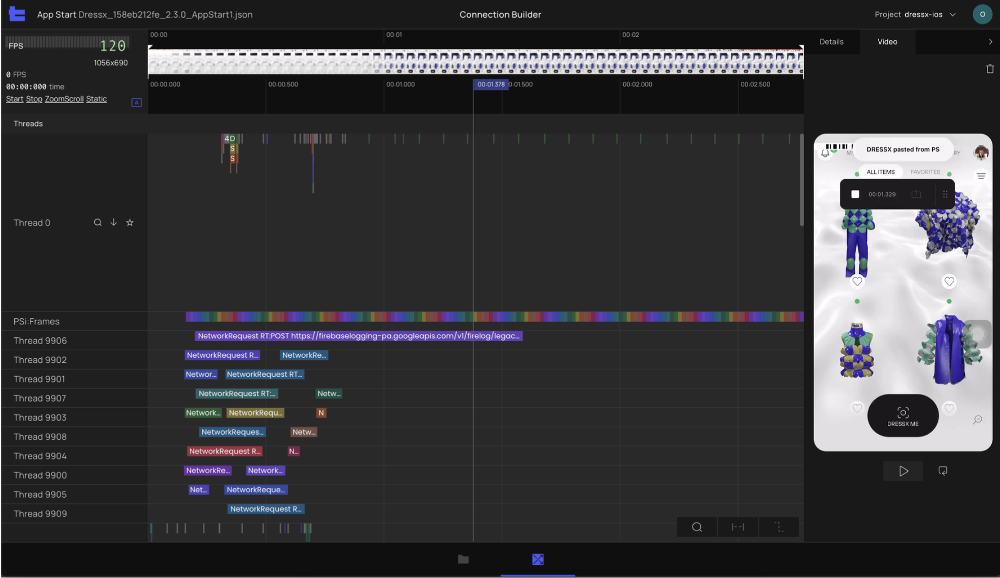

# R1.3 - Video

## New Feature - Video preview synced with trace

With the new Video synced with trace feature you will be able to see what’s happening on the phone screen at every point of the recorded 
trace.

Video synced with trace feature allows you to:

- Quickly find the beginning and end of user flows
- See the user actions
- Visually identify performance opportunities (like jitteriness, lags and long network requests)
- Visually identify when the screen was updated

Seeing how your application functions in real life provides valuable context that helps to understand what’s happening - even when the code 
is hard to follow:

- Ability to upload recorded video via PS Tool Web UI to a specific trace
- Video preview thumbnails that allow you to quickly navigate video on the global timeline
- Video tab
    - Large Preview of the video recording
        - Ability to play and pause video
        - Ability to loop video
        - Ability to delete video

## Companion App

- Ability to upload recorded video via Companion app to a specific trace
- Added information with User Flow description
- Added information with project platform information in the project list
- Added information with user role

## Trace Viewer

- Vertical scroller on flamegraph, with the ability to jump to the top or bottom
- Ability to pin a selected choreographer and made it available to anyone opening the trace
- Disable pin-zoom for non flame chart elements

## Misc

- Updated technical copies to human readable copies for all error messages
