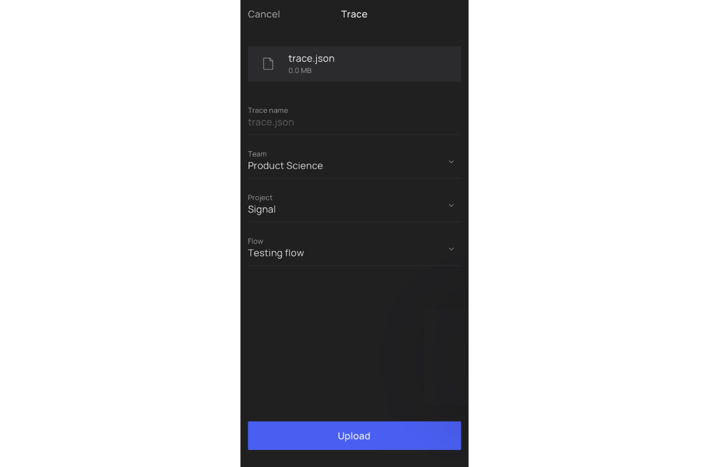

# iOS Trace Recording

## Record

### 1. Install instrumented app

- Install the app you [instrumented in the previous steps](../ios/distribution.md#ios-application-distribution-instructions). 
- Make sure it is instrumented

### 2. Select a user flow you want to analyze

At Product Science, performance optimization starts with defining key user flows that bring the most value to users.

##### What is a user flow?

There are several ways to select a user flow:

- [**Preferred**] __An "Action-Reaction" one-step flow__. 
  Here, the user starts with an "Action" (pressing a button, swiping, selecting a menu item, etc.) 
  and you measure until a "Reaction" (new page being fully displayed, etc.). 
  These flows are clean and simple to analyze.
- __More complex flows__. Sometimes, there are multiple steps that need to be strung together to get an idea of 
  the performance of a feature. 
  It can make sense to have flows like these, but consider carefully if they can be broken down into smaller parts.

Either way, a sequence of functions execute before the user finally arrives at the final state ("Reaction"). 
This is where our AI technology comes into play—highlighting the sequences that formed into what 
we call __execution paths__.

**Note: User flows should be short in length, 30 seconds or less, to enable the analysis to be a manageable size.**

### 3. Trace and screen recording

You can start trace recording from the instrumented app itself. 
If you want to capture app start, you can kick off trace recording from PS Companion app. 

| Step | To record App Start Flow                                                                                                                                                      | To record any Flow other than App Start                                                                                                                     |
|:-----|:------------------------------------------------------------------------------------------------------------------------------------------------------------------------------|:------------------------------------------------------------------------------------------------------------------------------------------------------------|
| 1    | [Optional] Quit all open apps so nothing slows down the app you are measuring.                                                                                                | [Optional] Quit all open apps so nothing slows down the app you are measuring.                                                                              |
| 2    | Open PS Companion app. If you don't have a designated folder for app start, create a new one. Open the folder.                                                                | Open your instrumented app and perform all the actions before the beginning of the user flow you are analyzing.                                             |
| 3    | Start screen recording.                                                                                                                                                       | Start screen recording.                                                                                                                                     | 
| 4    | At the bottom right corner, tap thebutton to start trace recording.                                                                        | At the  panel, tapbutton to start trace recording.              |
| 5    | Perform the user actions from the[(user) flow](https://www.productscience.ai/documentation?doc=dictionary&sub=user-flow)and that you want to optimize.                        | Perform the user actions from the[(user) flow](https://www.productscience.ai/documentation?doc=dictionary&sub=user-flow)and that you want to optimize.      |
| 6    | Once the final step is fully loaded, at the  panel, tap button to stop recording. | Once the final step is fully loaded, at the  panel, tap button to stop recording. |

## Upload

### 4. Upload trace to PS Tool

- Tap the 'Export' button to export your trace file.

- Choose PS Companion app among sharing options:

[Don't see PS Companion app? Customize the share sheet.](device-set-up-android.md#3-customize-share-sheet)

- Name the trace, and add it to the corresponding user flow folder
#### Attach screen recording
- On the same screen, while the trace details screen is still opened, tap 'Select'

- Phone library opens &gt; select the screen recording

{ width="300" }

- Once the trace and video finish uploading and processing, you can view your trace in PS Tool. 
  The uploaded trace will appear in your productscience.app User Flow Library.

